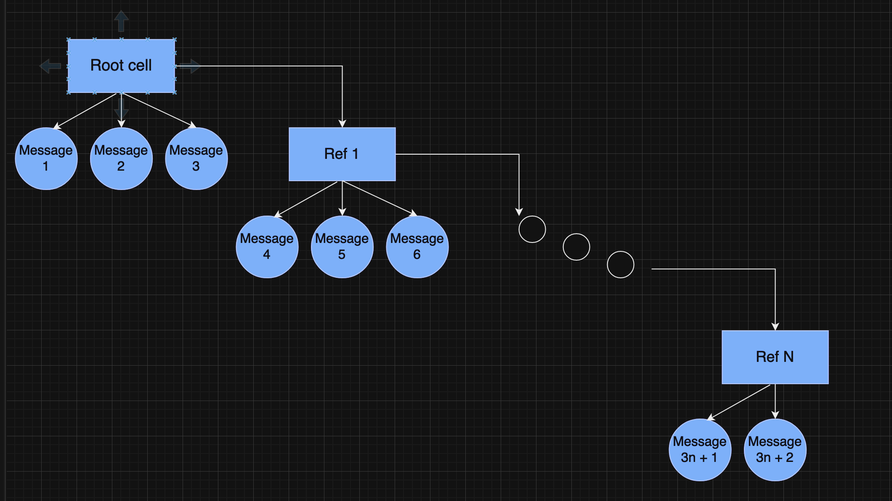
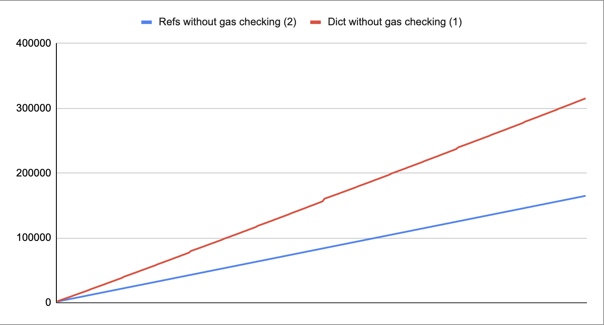

# Message Relayer

**TL;DR нужный смарт-контракт называется relayer_refs_check.fc**

## Задача

Необходимо было реализовать смарт-контракт на FunC, который принимает internal сообщение со списком сообщений, которые необходимо отправить.
При обработке сообщения контракт должен выполнять проверку на то, что с сообщением отправлено достаточно TON для дальнейших действий. 

## Решение

Изначально было рассмотрено 2 концепции, отличающиеся по формату отправляемого списка сообщений:
1) Список представлен классическим словарем, где ключ — номер сообщения, значение — само сообщение
2) Список представлен в виде кастомной структуры, где в каждой ячейке, кроме последней, есть три ссылки на сообщения и одна ссылка на следующую ячейку, а последняя ячейка содержит от 1 до 3 ссылок на сообщения. Ниже представлена схема структуры.

С помощью тестов ([1](tests/RelayerDict.spec.ts), [2](tests/RelayerRefs.spec.ts)) было выяснено, что вторая структура является более оптимальной, т.к. расходует значительно меньше газа (почти в 2 раза меньше на больших числах). Ниже представлен график расхода газа для контрактов с каждой из структур (по оси Y нанотоны).

Так как вторая структура оказалась лучше, то в финальной версии контракта было решено использовать ее. В контракт `RelayerRefs` были добавлены проверки на газ, реализованные с помощью новых инструкций TVM. Т.к. отправка сообщений задействует [неопределенное количество газа](https://docs.ton.org/develop/smart-contracts/fee-calculation#calculation-flow-2), то "хардкод" газа был невозможен, вместо него использовались функции `gas_consumed()` и `send_message()` (еще стоило бы использовать `get_forward_fee()` для оптимизации отправки "excesses", но я не понял, как оно работает).

## Тесты

Для проверки корректности работы контракта были написаны [тесты](tests/RelayerRefsCheck.spec.ts). В них проверяется, что:
1) Контракт успешно пересылает необходимые сообщения в случае, если он получает достаточно TON
2) Контракт возвращает не использованные в качестве газа TON, при этом баланс контракта не уменьшается после обработки большого кол-ва транзакций
3) Контракт баунсит транзакцию в случае, если ему не хватило TON для отправки всех сообщений